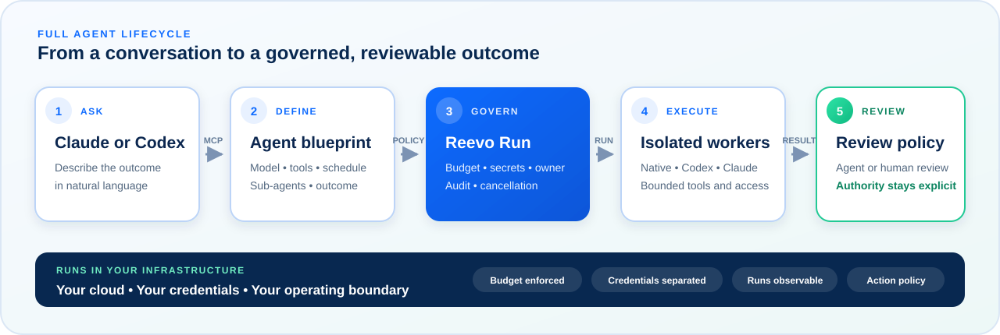

<div>
  
  <h1>Reevo Run</h1>
  <h3>Your agents. Your cloud. Your budget.</h3>
  <p><strong>Most agent runners focus on helping a model complete a task. Reevo Run is the self-hosted control plane that decides whether the task should run, limits what it can access, and returns a human-reviewable outcome.</strong></p>
  <p>Budget is enforced as admission control: spend is reserved before execution, so work that cannot fit the budget never starts.</p>
  <p>
    <a href="#why-reevo-run">Why Reevo Run</a> ·
    <a href="#a-full-cycle-agent-from-one-conversation">Full-cycle example</a> ·
    <a href="#host-it-in-your-cloud">Deployments</a> ·
    <a href="#quickstart">Quickstart</a> ·
    <a href="#security-boundaries">Security</a>
  </p>
</div>
<br clear="left">

[](https://github.com/chfields/reevo-run/actions/workflows/security.yml)
[](LICENSE)

> **Project status:** the control plane, scheduler, budget groups, MCP server,
> native agents, isolated Codex and Claude Code workers, GitHub draft-PR flow,
> and local observability stack are implemented and tested. Production
> readiness and cloud deployment coverage are still being expanded.

## Why Reevo Run

AI agents are easy to demo and harder to operate. Once an agent can spend
money, use credentials, change a repository, or run without a person watching,
teams need more than a prompt and a cron job.

Reevo Run provides the control plane around the model:

| For engineering leaders                                                     | For developers                                                                    |
| --------------------------------------------------------------------------- | --------------------------------------------------------------------------------- |
| Put explicit cost, ownership, and approval boundaries around agent work.    | Create and manage agents from Claude or Codex through MCP.                        |
| Keep execution, data, and credentials in infrastructure your team controls. | Choose OpenAI, Anthropic, or Bedrock-backed models per agent.                     |
| Turn one-off experiments into scheduled, observable operating processes.    | Attach scoped tools, secrets, schedules, memory, and sub-agents.                  |
| Preserve human accountability for code and production changes.              | Run coding tasks in isolated Codex or Claude Code workers that produce draft PRs. |

The result is not another autonomous black box. It is a way to make agent work
repeatable, bounded, inspectable, and reviewable.

## One control plane, the full lifecycle



Claude and Codex are the operator experience. Reevo Run is the durable system
behind them: it stores agent definitions, triggers work, reserves budget,
mediates tools and credentials, records outcomes, and exposes run state through
MCP.

## A full-cycle agent from one conversation

Ask your MCP client:

> Create a weekly dependency-maintenance agent for this repository. Use Claude
> Code, put it in a $5 weekly budget group, run it Thursday at 2:00 AM, execute
> the test suite, and open a draft pull request when a safe update is ready.
> Never merge automatically.

Claude or Codex can translate that request into Reevo MCP operations such as
`create_budget_group`, `create_agent`, `attach_tool`, `trigger_agent`, and
`get_run`. After that:

1. The scheduler or an event creates an owned run.
2. Reevo reserves budget and resolves only the capabilities assigned to that
   agent.
3. An isolated coding worker receives the task without receiving the GitHub App
   credential or provider API key.
4. The worker changes the checkout and runs its approved checks.
5. Trusted finalization validates the diff, pushes a unique branch, and opens at
   most one draft pull request.
6. A person reviews and decides whether anything merges.

The same agent can be updated, paused, triggered, inspected, or deleted from an
MCP conversation. The CLI remains available as the bootstrap and operations
floor.

## Agent ecosystems you can compose

Reevo provides lifecycle primitives rather than prescribing one fixed catalog.
These are example systems a team can build and manage through MCP:

| Agent system             | Typical cycle                                                      | Human-reviewed outcome               |
| ------------------------ | ------------------------------------------------------------------ | ------------------------------------ |
| **Delivery pipeline**    | Work request → plan → implementation → tests → review              | Draft feature or bug-fix PR          |
| **Security maintenance** | Scheduled scan → assess → patch → verify                           | Draft dependency or remediation PR   |
| **Architecture review**  | Inspect codebase → score risks → prioritize findings               | Architecture and risk report         |
| **QA coverage**          | Map journeys → rank gaps → add tests → run suite                   | Draft test-coverage PR               |
| **System monitoring**    | Receive signal → investigate → correlate → escalate                | Actionable defect or incident report |
| **Project tracking**     | Read delivery data → compare plan, cost, and progress → flag drift | Portfolio or program update          |

Agents can stand alone or be connected as bounded sub-agents. Shared budget
groups can cap the combined spend of an ecosystem, while each agent retains its
own model, tools, schedule, and run history.

## Host it in your cloud

The core does not import a cloud SDK. Jobs, model access, email, secrets,
authentication, and object storage sit behind provider interfaces so operators
can choose the infrastructure boundary that fits their environment.

| Target                               | Current support                                                                                                                                 |
| ------------------------------------ | ----------------------------------------------------------------------------------------------------------------------------------------------- |
| **Local Docker, VM, or on-premises** | Portable PostgreSQL and container workflow for development and self-hosting.                                                                    |
| **Production container baseline**    | Separate runtime and migration images plus a Compose/Caddy reference boundary.                                                                  |
| **GCP**                              | Terraform reference for the control plane on Cloud Run and Cloud SQL. Cloud-native coding jobs and production observability are follow-on work. |
| **AWS**                              | The portable runtime and Bedrock model adapter are available; a native AWS deployment module is planned.                                        |
| **Other clouds**                     | Run the production image and provide equivalent PostgreSQL, secrets, ingress, egress, and monitoring controls.                                  |

Start with [deployment targets](deploy/README.md), the
[portable production boundary](deploy/production/README.md), or the
[GCP setup guide](deploy/gcp/SETUP.md). Reference deployments are examples,
not a requirement to use one vendor.

## Security boundaries

- **Hard budget enforcement:** per-agent limits and shared daily, weekly, or
  monthly budget groups stop additional model work when the cap is reached.
- **Scoped capabilities:** tools, secrets, datastores, and sub-agents are
  attached explicitly and checked against the authenticated owner.
- **Sandboxed tools:** native agent tools execute inside a constrained QuickJS
  environment with controlled fetch and secret bindings.
- **Isolated coding workers:** Codex and Claude Code run in hardened containers
  with resource limits, protected paths, bounded output, and reviewed network
  access.
- **Credential separation:** workers do not receive provider credentials or the
  GitHub App private key; trusted components proxy model use and finalize Git.
- **Human merge gate:** coding runs create draft pull requests. Reevo does not
  auto-merge them.
- **Protected remote MCP:** HTTP transport is an OAuth 2.1 resource server;
  local stdio mode trusts the local operator.
- **Sanitized operations:** lifecycle events and metrics exclude prompts,
  repository content, credentials, diffs, and raw worker output.

Read the [runtime architecture](docs/architecture-runtime.md),
[coding-worker isolation model](docs/coding-worker-isolation.md), and
[security deployment guide](docs/security-deployment.md) before enabling a
production repository.

## Quickstart

Requirements: Node.js 22.12 or newer, Docker, and one supported model-provider
credential.

```sh
git clone https://github.com/chfields/reevo-run.git
cd reevo-run
npm ci
cp .env.example .env
```

Edit `.env` and set `OPENAI_API_KEY` or `ANTHROPIC_API_KEY`. Generate a local
secret-encryption key with `openssl rand -hex 32` and use it as
`SECRET_APP_KEY`. Then initialize the local database and start the stdio MCP
server:

```sh
npm run db:up
npm run prisma:generate
npm run prisma:migrate
npm run cli -- mcp
```

Point Claude or Codex at `npm run cli -- mcp` with the repository as its working
directory. The exact client configuration format differs, but both use Reevo's
stdio transport locally. For shared or remote access, use Streamable HTTP with
OAuth and the production boundary documented above.

Once connected, ask the client to list the available Reevo tools, create an
agent with a small budget, trigger it, and inspect the run. Coding-agent setup
additionally requires a dedicated GitHub App, immutable worker images, and the
proxy boundary described in the [local coding smoke guide](docs/local-phase5-smoke.md).

## What is implemented

- MCP-first agent, tool, schedule, budget-group, secret, datastore, webhook,
  run, and sub-agent management.
- Scheduled and event-triggered native agents with OpenAI, direct Anthropic,
  and Bedrock-Claude model routing.
- Per-run budgets, shared budget groups, usage accounting, and cancellation.
- QuickJS tool isolation with host allowlists and secret bindings.
- Containerized Codex and Claude Code executors with trusted GitHub draft-PR
  finalization.
- In-process reconciliation and optional DBOS durable workflows.
- Self-hosted or delegated OAuth for remote MCP access.
- Prometheus metrics and provisioned Grafana dashboards for local operations.
- Portable production images, a Compose/Caddy boundary, and a GCP control-plane
  Terraform reference.

This project is under active development. The
[coding-agent release gate](docs/phase-5-release-gate.md) records tested live
evidence; the [production-readiness roadmap](docs/phase-7-production-readiness.md)
tracks remaining operational work without assuming one hosting provider.

## Repository map

```text
src/core/       Agents, runner, scheduler, triggers, budgets, and sandbox
src/mcp/        MCP transports, authentication, and management tools
src/providers/  Swappable model, job, VCS, email, auth, secret, and storage seams
src/coding-worker/ and src/claude-coding-worker/
                Isolated Codex and Claude Code execution
deploy/         Local, production-reference, observability, and cloud deployment
prisma/         Schema and reviewed migrations
docs/           Architecture, security, operations, evidence, and roadmap
```

## License

Apache License 2.0. See [LICENSE](LICENSE).

Built as an independent reimplementation. See [CLEANROOM.md](CLEANROOM.md).
