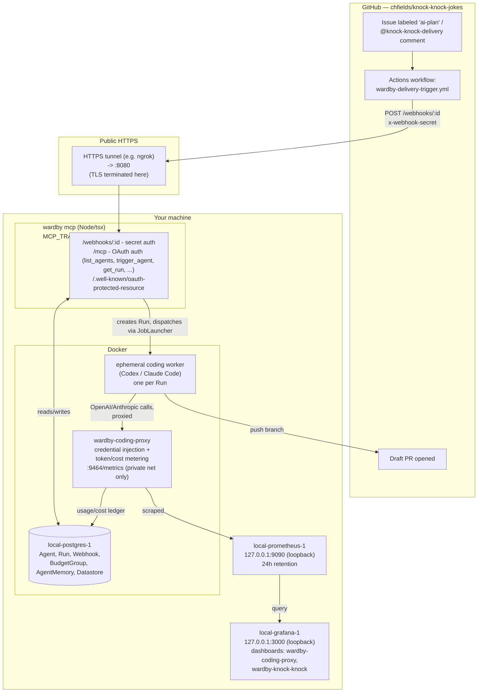

# Runtime architecture — GitHub trigger path + observability

Two independent subsystems currently run side by side on the same host and
share only Postgres and a Docker Compose network: the `wardby mcp` process
(agents/runs/webhooks/MCP tools) and the observability stack shipped in
`feat: add local Prometheus and Grafana observability` (coding-proxy metrics
→ Prometheus → Grafana). Neither depends on the other; restarting one has no
effect on the other.

## Key boundaries

- **Only one thing is reachable from outside this machine:** the HTTPS
  tunnel into `wardby mcp:8080`. Postgres, coding-proxy, Prometheus, and
  Grafana are all either fully private-network-only (`coding-proxy:9464`
  has no `ports:` mapping at all) or explicitly loopback-bound
  (`127.0.0.1:9090`, `127.0.0.1:3000`) — Grafana/Prometheus are not exposed
  through the tunnel.
- **The coding worker never sees real API credentials.** `wardby-coding-proxy`
  sits between it and OpenAI/Anthropic, injecting credentials and metering
  tokens/cost — this is also where `/metrics` lives.
- **Two write paths into Postgres:** `wardby mcp` owns the agent/run/webhook
  config tables directly; `coding-proxy` writes its own usage/cost ledger
  directly during a run, which `wardby mcp` reconciles back into the `Run`
  row once the container finishes (the "cap at the boundary, reconcile
  after" pattern for opaque agent runs).
- **`wardby mcp` restarts don't affect observability, and vice versa** —
  confirmed 2026-09-13: the `RunTrigger.webhook` fix required restarting
  `wardby mcp` only; the Prometheus/Grafana stack (PR #25) required
  rebuilding only the `coding-proxy` container, with no `wardby mcp` restart.

## Where the worker actually runs

The diagram above shows `JOB_LAUNCHER=docker`, which is what this host uses.
The worker's execution backend is a seam (`WorkspaceJobLauncher`), and the
choice does not change any boundary above — the worker still holds no
credentials, still reaches only the proxy, and the proxy still owns the ledger.

| `JOB_LAUNCHER` | Worker runs in                   | Isolation                                            |
| -------------- | -------------------------------- | ---------------------------------------------------- |
| `local`        | a child process on this host     | development only, no isolation                       |
| `docker`       | a container on a per-run network | the diagram above                                    |
| `kubernetes`   | a pod in a namespace             | per-run NetworkPolicy, attested pod, optional gVisor |

Under `kubernetes` the shape is the same with different nouns: the per-run
Docker network becomes a NetworkPolicy, the keeper and worker share a pod
instead of a volume, and the proxy is a Service rather than a container name.
Two things have no Docker equivalent. The pod read back from the API server is
compared field by field against the pod wardby built, and any difference fails
the run; and before the worker is released, the launcher proves the network
policy is actually being enforced, because a cluster accepts a policy whether
or not anything enforces it. See
[coding-worker-isolation.md](coding-worker-isolation.md) for the mechanics and
[phase-12-kubernetes-evidence.md](phase-12-kubernetes-evidence.md) for what a
real cluster proved, including the bugs that only appeared there.
